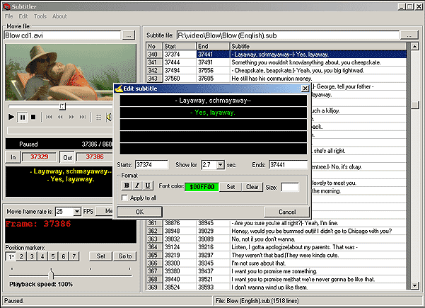



## DivX Subtitler 1\.0

### Description

Subtitle editor / viewer for your DivX movies. Use it to create/edit subtitles, split, merge or convert subtitle files, generate MicroDVD .ini files, and more. Supports 2 file formats: .SUB and .SRT, with various color and font formats. Can be used as a simple player too. Fully functional. Code is commented now and a basic help file is included. I hope you'll find it useful :-)
 
### More Info
 

             |
---                |---
**Submitted On**   |2002-10-02 10:59:20
**By**             |[Jordy](https://github.com/Planet-Source-Code/PSCIndex/blob/master/ByAuthor/jordy.md)
**Level**          |Intermediate
**User Rating**    |4.5 (36 globes from 8 users)
**Compatibility**  |VB 5\.0, VB 6\.0
**Category**       |[Complete Applications](https://github.com/Planet-Source-Code/PSCIndex/blob/master/ByCategory/complete-applications__1-27.md)
**World**          |[Visual Basic](https://github.com/Planet-Source-Code/PSCIndex/blob/master/ByWorld/visual-basic.md)
**Archive File**   |[DivX\_Subti1424561082002\.zip](https://github.com/Planet-Source-Code/jordy-divx-subtitler-1-0__1-38831/archive/master.zip)

